<div align=center>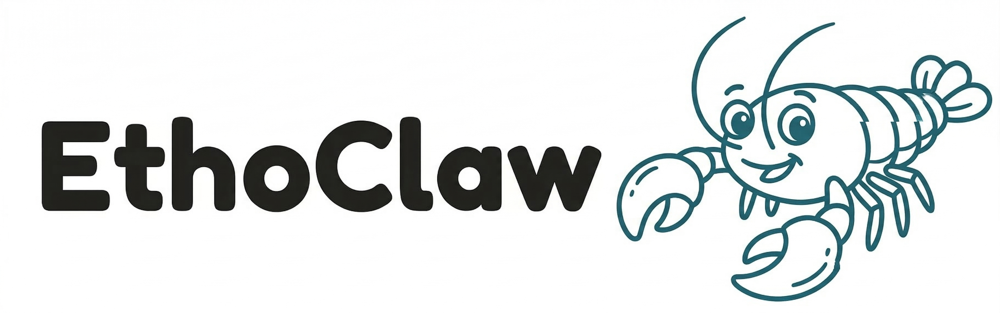</div>

<p align="center">
  <a href="README.md">English</a>
</p>

[](./backend/pyproject.toml)
[](./Makefile)
[](./LICENSE)

**EthoClaw** 是基于 OpenClaw 构建的 Ethology 领域开源项目，核心聚焦于行为学领域实用技能的落地实现。针对行为学分析中预处理、数据转换、格式匹配、环境配置等繁琐流程，EthoClaw 不仅能帮助研究人员自动完成这些操作，还可实现网络信息检索、分析报告与结果图生成、本地文献解读、自动化目标定位、自动姿态估计等功能，从而让研究人员更专注于解决科学问题，大幅提升科研效率。此外，我们针对OpenClaw进行了性能优化，可改善我们的使用体验。

## 已支持物种

- 黑色单只小鼠

## 已支持实验场景

- 旷场、高架等二维俯拍场景

## 已支持的功能

- **动物目标定位**：1.基于图像处理方法，自动定位实验目标（如动物、环境元素等）。
  <div align=center>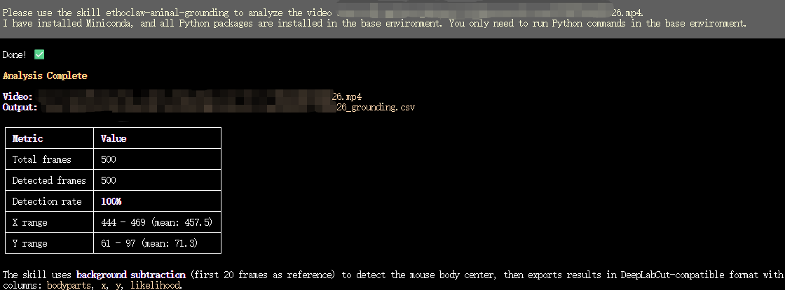</div>
  <div align=center></div>
  <div align=center></div>

- **动物姿态估计**：
  1. 接入开源的深度学习姿态估计模型/项目，自动估计实验目标的姿态（如头部、背部、尾部等）。例如，目前已接入了[SuperAnimal](https://github.com/AdaptiveMotorControlLab/modelzoo-figures)。
  <div align=center>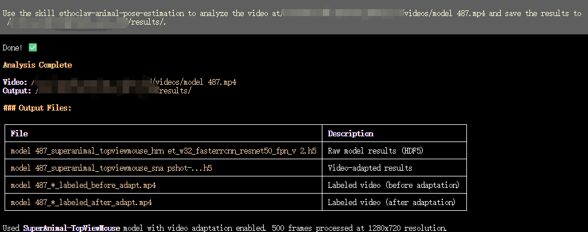</div>
  <div align=center></div>
  <div align=center></div>

- **图表/报告生成**：
  1. 基于追踪数据生成速度热图、轨迹热图；
  <div align=center></div>

  2. 支持多组数据的小提琴图、聚类图、雷达图等；自动排版实验流程图和分析图；
  <div align=center>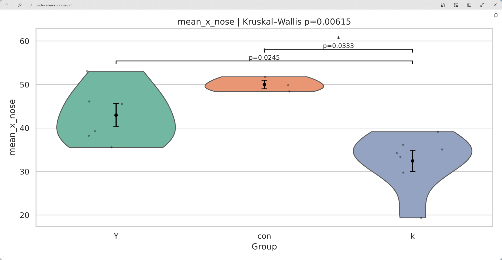</div>
  <div align=center>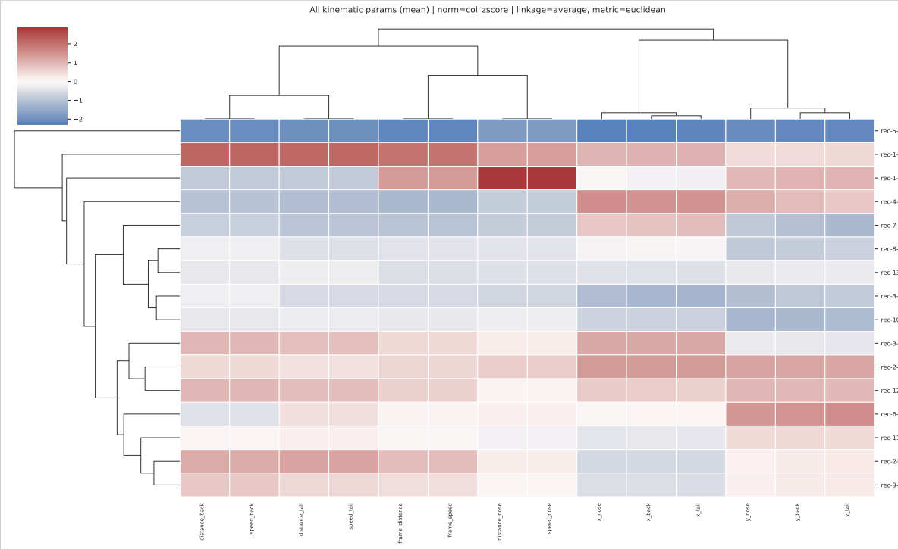</div>
  <div align=center>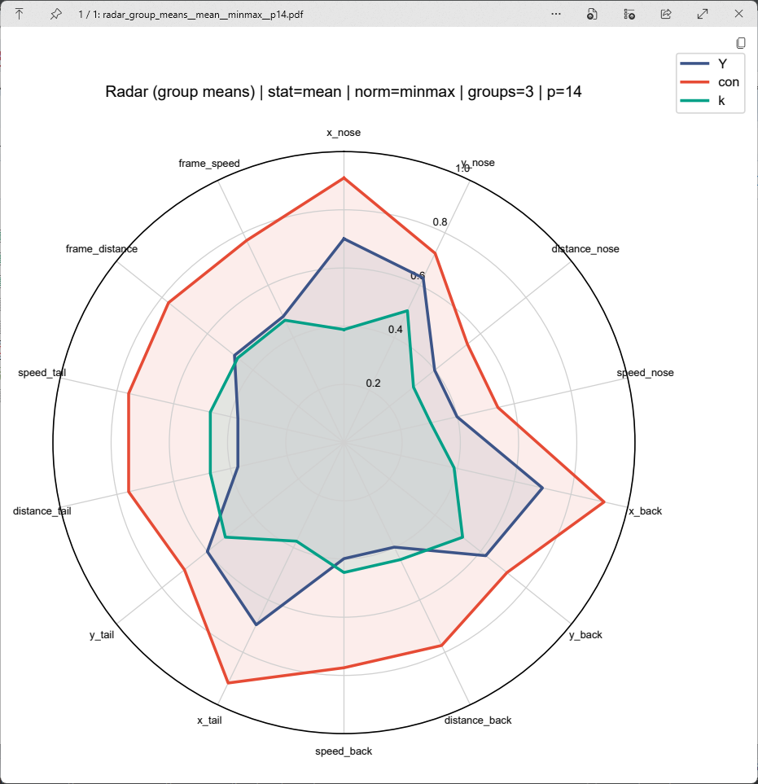</div>

  3. 支持CSV/Excel格式转换到推荐格式；
  4. 自动排版生成论文所需figure；
  <div align=center>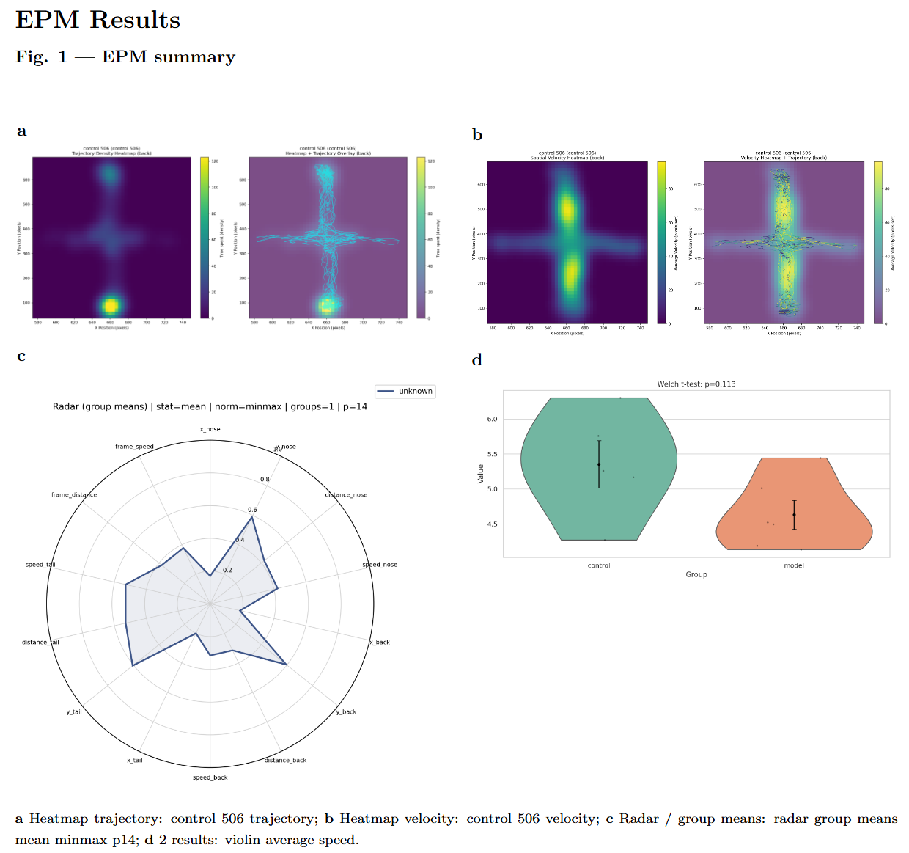</div>

  5. 生成包含实验背景、样本信息、分析内容和总结的分析报告。
  <div align=center>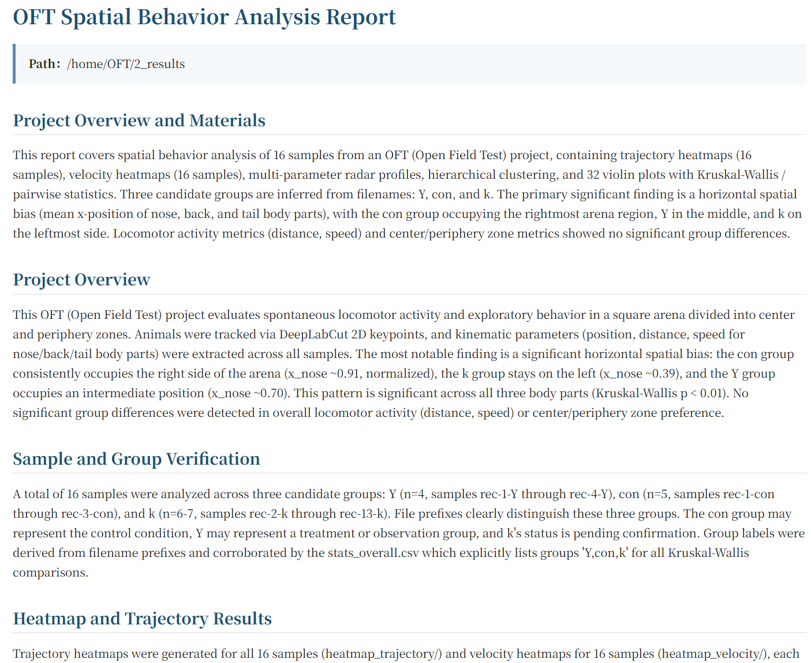</div>

- **教程辅助**：
  1. 为初学者提供参数计算方法、图表数据来源、聚类方法及参数等详细说明，便于论文方法部分撰写。
  <div align=center>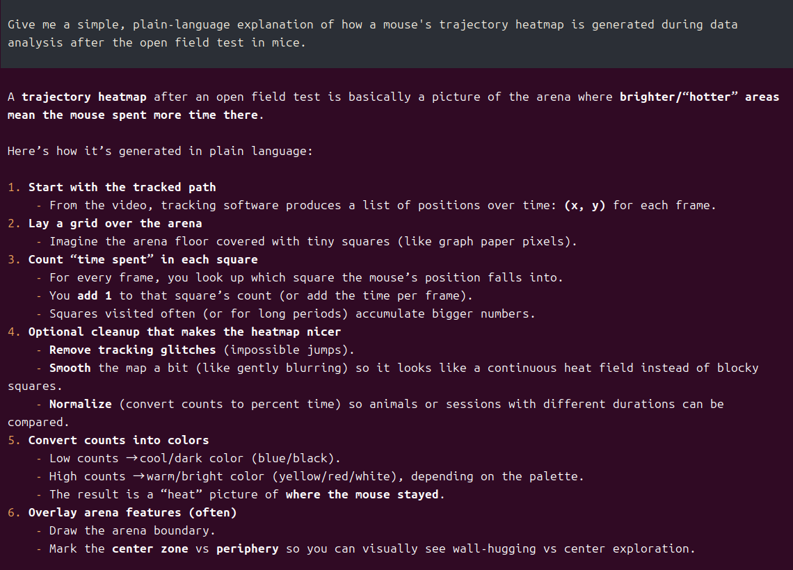</div>
- **本地知识库**：
  1. 读取本地PDF论文和报告，总结并输出。
  <div align=center>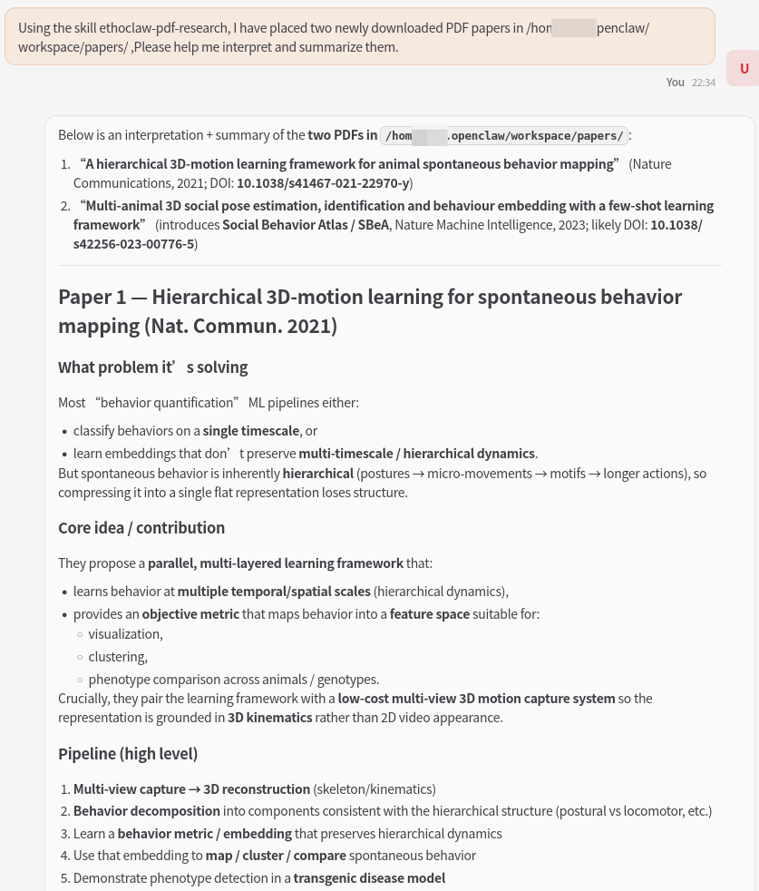</div>
- **网络搜索**：
  1. 通过网页或学术搜索获取最新论文，支持每日定时推送arxiv/PubMed的相关论文。
  <div align=center>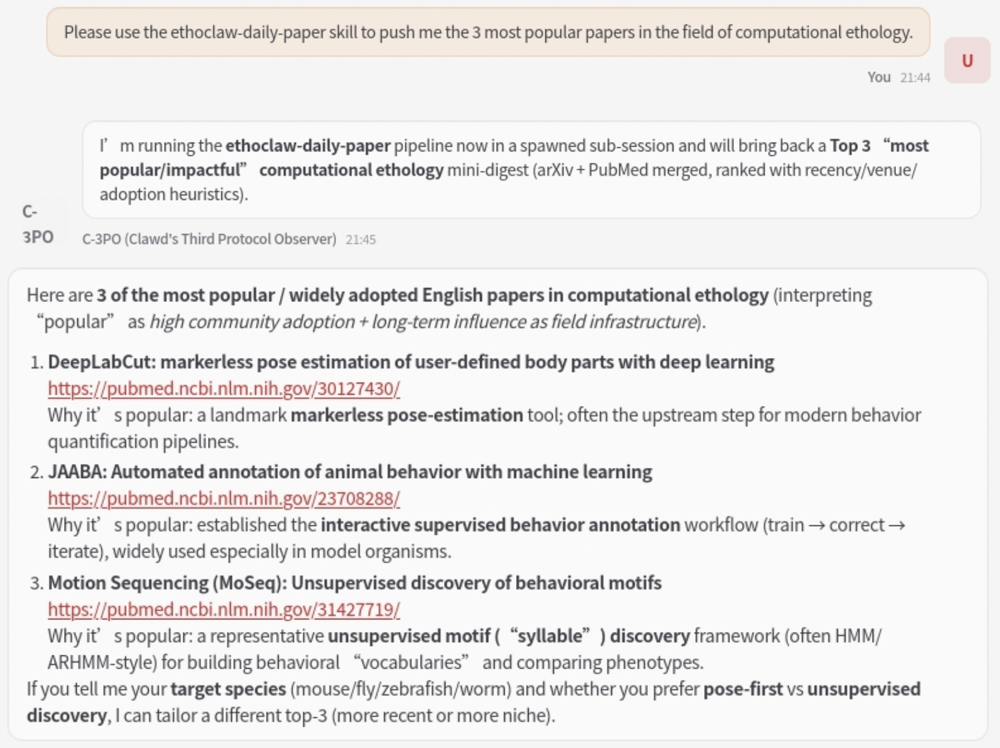</div>
- **注**：
  由于EthoClaw基于OpenClaw构建，因此继承了OpenClaw的所有功能，且和OpenClaw的使用方式相同，兼容OpenClaw的所有插件（例如ClawHub或第三方插件市场）和channel（例如WhatsApp, Telegram, Slack, Discord, Google Chat, Signal, iMessage, BlueBubbles, IRC, Microsoft Teams, Matrix, Feishu, LINE, Mattermost, Nextcloud Talk, Nostr, Synology Chat, Tlon, Twitch, Zalo, Zalo Personal, WebChat等）。

## 快速开始

本项目基于OpenClaw构建，配置和安装方式与OpenClaw类似或相同。

本项目有两种食用方式：

**1. 如果您已经安装了OpenClaw，可以直接将EthoClaw中skill下带有`ethoclaw-`前缀的文件夹拖入OpenClaw的SKILL文件夹下**

**2. 如果您还没有安装OpenClaw，也可以直接按照以下步骤安装EthoClaw：**

### 系统要求

- 系统要求和OpenClaw相同，推荐ubuntu 24.04 LTS版本。
- 如果要开启自动化姿态估计功能，电脑最好安装**NVIDIA GPU**，并且安装CUDA和cuDNN。

### 安装

```bash
# 下载并安装 nvm：
curl -o- https://raw.githubusercontent.com/nvm-sh/nvm/v0.40.3/install.sh | bash
# 代替重启 shell
\. "$HOME/.nvm/nvm.sh"
# 下载并安装 Node.js：
nvm install 24
# 验证 Node.js 版本：
node -v # Should print "v24.14.0".
# 下载并安装 pnpm：
corepack enable pnpm
# 验证 pnpm 版本：
pnpm -v

# 下载并安装 miniconda
wget https://repo.anaconda.com/miniconda/Miniconda3-latest-Linux-x86_64.sh
bash Miniconda3-latest-Linux-x86_64.sh
# 初始化conda
conda init bash
# 重启shell
source ~/.bashrc

# 下载 EthoClaw 代码：
git clone https://github.com/penciler-star/EthoClaw.git
cd EthoClaw
# 安装
pnpm install
pnpm ui:build # auto-installs UI deps on first run
pnpm build
# 配置 EthoClaw 环境
pnpm openclaw onboard --install-daemon
# 启动 EthoClaw
pnpm gateway:watch


# 如果需要开启姿态估计功能，且电脑已有了NVIDIA GPU
# 1. 安装驱动，CUDA和cuDNN
# 2. 参考https://pytorch.org/，安装和电脑对应的torch版本
# 3. 安装姿态估计模型依赖，这里使用DeepLabCut
pip install --pre deeplabcut
```

### 推荐工程结构

```
Analysis_Project/
├── 0_videos/
└── 1_2Dskeleton/
└── 2_results/
```

## 许可证

本项目采用 MIT License 开源发布。

## 致谢

EthoClaw 建立在开源社区大量优秀工作的基础上。

特别感谢以下项目带来的关键支持：

[OpenClaw](https://github.com/openclaw/openclaw)：运行在个人设备上的强大且开源的AI智能体助手。
[DeepLabCut](https://github.com/DeepLabCut/DeepLabCut)：应用广泛的基于深度学习的无标记动物姿态估计工具。
这些项目体现了开源协作真正的力量，我们也很高兴能继续建立在这些基础之上。

### 开发者

<a href="https://github.com/huangkang314"></a>
<a href="https://github.com/penciler-star"></a>
<a href="https://github.com/fxqaq"></a>
<a href="https://github.com/yichuan1998"></a>
<a href="https://github.com/troyc126"></a>
<a href="https://github.com/LZAndy"></a>
<a href="https://github.com/Liangjh40"></a>
<a href="https://github.com/B-Done"></a>
<a href="https://github.com/HiganBanamm"></a>
<a href="https://github.com/Liyeczm"></a>

## 反馈

如果您在使用本项目过程中遇到任何问题或有任何建议，欢迎通过[Issues](https://github.com/penciler-star/EthoClaw/issues)反馈。
