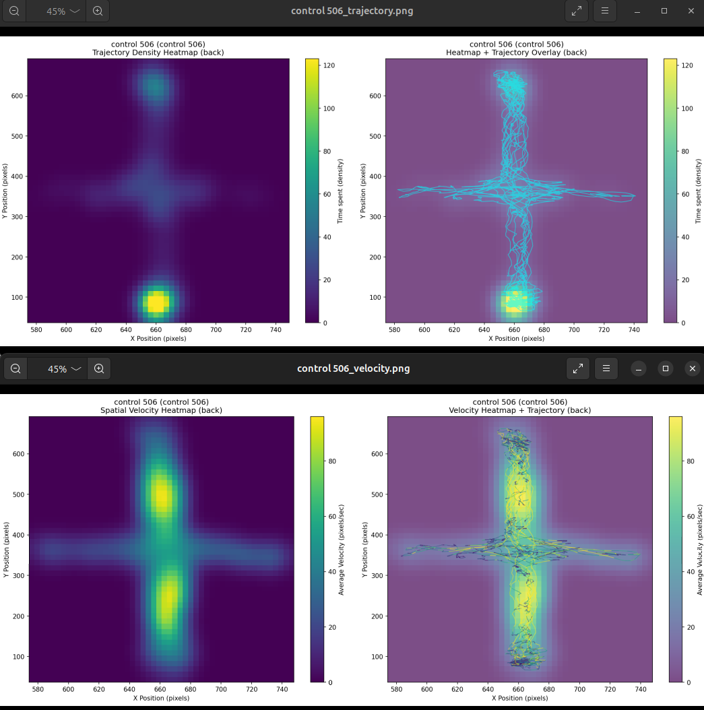
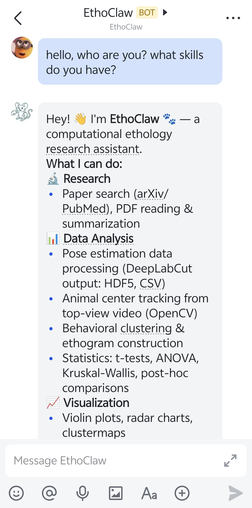

<div align=center></div>

<p align="center">
  <a href="README-zh.md">中文</a>
</p>

<font size=4><div align='center'> [](./backend/pyproject.toml) [](./Makefile)
[](./LICENSE) </div></font>

**EthoClaw** is an open-source project in the field of Ethology built on OpenClaw, with a core focus on implementing practical skills for behavioral research.Targeting cumbersome workflows in ethological analysis—such as preprocessing, data conversion, format matching, and environment setup—EthoClaw not only automates these tasks for researchers but also supports web information retrieval, analytical report and result figure generation, local literature interpretation, automated object localization, and automatic pose estimation, enabling researchers to focus more on solving scientific questions and significantly improving research efficiency. Additionally, we have conducted performance optimizations for OpenClaw to enhance our user experience.

## Supported Species

- Black mouse

## Supported Experiment Scenarios

- Open field, elevated plus maze, and other 2D top-down scenarios

## Highlighted Features

- **Animal Center Detection:**
  1. Based on image processing methods, automatically locate animal.
  <div align=center></div>
  <div align=center></div>
  <div align=center></div>

- **Animal Pose Estimation:**
  1. Access open-source deep learning pose estimation models/projects to automatically estimate the pose of experimental targets (such as head, back, tail, etc.). Currently, it has supported the [SuperAnimal](https://github.com/AdaptiveMotorControlLab/modelzoo-figures).
  <div align=center></div>
  <div align=center></div>
  <div align=center></div>

- **Chart/Report Generation:**
  1. Generate speed heatmaps and trajectory heatmaps based on tracking data;
  <div align=center></div>

  2. Support violin plots, cluster plots, radar charts, etc. for multiple groups of data;
  <div align=center></div>
  <div align=center></div>
  <div align=center></div>

  3. Support CSV/Excel format conversion to recommended format;
  4. Generate figures for papers automatically;
  <div align=center></div>

  5. Generate analysis reports including experiment background, sample information, analysis content, and summaries.
  <div align=center></div>

- **Tutorial Assistance:**
  1. Provide detailed explanations for beginners on parameter calculation methods, chart data sources, clustering methods and parameters, etc., to facilitate writing the methods section of papers.
  <div align=center></div>
- **Local Knowledge Base:**
  1. Read local PDF papers and reports, summarize and output them.
  <div align=center></div>
- **Network Search:**
  1. Obtain the latest papers through web or academic searches, supporting daily scheduled delivery of arxiv/PubMed related papers.
  <div align=center></div>
- **Note:**
  Since EthoClaw is built on top of OpenClaw, it inherits all features of OpenClaw and uses the same interface. It is fully compatible with all OpenClaw plugins (such as ClawHub or third-party plugin marketplaces) and channels (including WhatsApp, Telegram, Slack, Discord, Google Chat, Signal, iMessage, BlueBubbles, IRC, Microsoft Teams, Matrix, Feishu, LINE, Mattermost, Nextcloud Talk, Nostr, Synology Chat, Tlon, Twitch, Zalo, Zalo Personal, WebChat, etc.).
  <div align=center></div>

## Quick Start

This project is built on OpenClaw, and its configuration and installation methods are similar to or the same as OpenClaw.

This project has two ways to use:

**1. If you already have OpenClaw installed, you can directly drag the folders with the prefix `ethoclaw-` in the skill folder of EthoClaw into the `skill` folder of OpenClaw.**

**2. If you haven't installed OpenClaw yet, you can follow the steps below to install EthoClaw:**

### System Requirements

- System requirements are the same as OpenClaw, recommend ubuntu 24.04 LTS version.
- If you want to enable automated pose estimation functionality, it is recommended to have an **NVIDIA GPU** with CUDA and cuDNN installed.

### Installation

```bash
# Download and install nvm:
curl -o- https://raw.githubusercontent.com/nvm-sh/nvm/v0.40.3/install.sh | bash
# Instead of restarting shell
\. "$HOME/.nvm/nvm.sh"
# Download and install Node.js:
nvm install 24
# Verify Node.js version:
node -v # Should print "v24.14.0".
# Download and install pnpm:
corepack enable pnpm
# Verify pnpm version:
pnpm -v

# Download and install miniconda:
wget https://repo.anaconda.com/miniconda/Miniconda3-latest-Linux-x86_64.sh
bash Miniconda3-latest-Linux-x86_64.sh
# Initialize conda:
conda init bash
# Restart shell:
source ~/.bashrc

# Download EthoClaw code:
git clone https://github.com/penciler-star/EthoClaw.git
cd EthoClaw
# Install
pnpm install
pnpm ui:build # auto-installs UI deps on first run
pnpm build
# Configure EthoClaw environment
pnpm openclaw onboard --install-daemon
# Start EthoClaw
pnpm gateway:watch


# If you need to enable pose estimation functionality and have an NVIDIA GPU
# 1. Install drivers, CUDA, and cuDNN
# 2. Refer to https://pytorch.org/ to install the appropriate torch version for your computer
# 3. Install pose estimation model dependencies, here we use DeepLabCut
pip install --pre deeplabcut
```

### Usage Example

```
# You can specify the specific skill you want to use to achieve the desired function, and get the result, for example:

Please use the ethoclaw-pose_estimation skill to estimate the pose of the video in /home/xx/Analysis_Project/0_videos/video.mp4, and save the result to /home/xx/Analysis_Project/1_2Dskeletons/ folder.
or
Please use the ethoclaw-trajectory-velocity-heatmap-generate skill to generate the velocity heatmap of the results in /home/xx/Analysis_Project/1_2Dskeletons/, and save the result to /home/xx/Analysis_Project/2_results folder.

# And, you can state your request directly without specifying a skill, for example:

Please estimate the pose of the video in /home/xx/Analysis_Project/0_videos/video.mp4, and save the result to /home/xx/Analysis_Project/1_2Dskeletons/ folder.

```

### Recommended Project Structure

```
Analysis_Project/
├── 0_videos/
└── 1_2Dskeletons/
└── 2_results/
```

## License

This project is released under the MIT License.

## Acknowledgments

EthoClaw is built upon the excellent work of the open-source community.
We would like to express our special thanks to the following projects for their critical support:

[OpenClaw](https://github.com/openclaw/openclaw): A powerful and open-source AI agent assistant running on personal devices.

[DeepLabCut](https://github.com/DeepLabCut/DeepLabCut): A widely-used deep learning-based pose estimation tool without manual annotation.

These projects embody the true power of open-source collaboration, and we are delighted to continue building on these foundations.

### Contributors

<a href="https://github.com/huangkang314"></a>
<a href="https://github.com/penciler-star"></a>
<a href="https://github.com/fxqaq"></a>
<a href="https://github.com/yichuan1998"></a>
<a href="https://github.com/troyc126"></a>
<a href="https://github.com/LZAndy"></a>
<a href="https://github.com/Liangjh40"></a>
<a href="https://github.com/B-Done"></a>
<a href="https://github.com/HiganBanamm"></a>
<a href="https://github.com/Liyeczm"></a>

## Feedback

If you encounter any issues or have suggestions while using this project, please provide feedback through [Issues](https://github.com/penciler-star/EthoClaw/issues).
